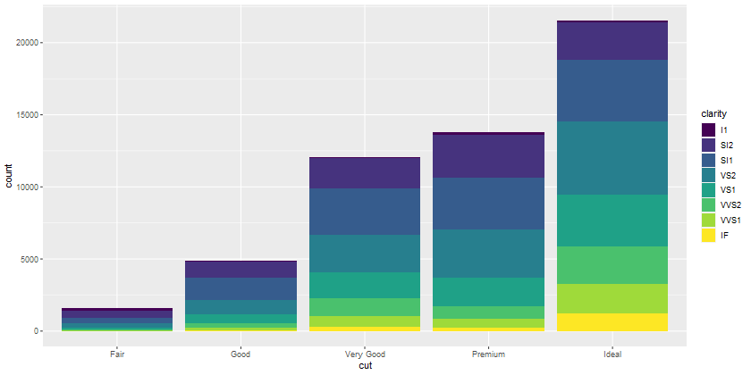

An Introduction to the Tidyverse | Session Five
====================================
author: Tim Hargreaves
date: 2019-10-31
width: 1440
height: 900
css: presentation.css

Recap
====================================
type: section


Tidy Data
====================================

* Tidy data always satisfies three interrelated rules:

  1. Each variable (a value you can measure) must have its own column
  2. Each observation (a thing which has measurable properties) must have its own row
  3. Each value must have its own cell

* Due to the iterrelations of these rules we can simplify this to the following two-step procedure:

  1. Put each dataset in tibble
  2. Put each variable in its own column

Dealing With Untidy Data
====================================

* Most untidy data sufferes from one of four faults:
  * If our dataset has the values of a variable as columns, we use `gather()`
  * If we have variables contains in the cells of our dataset, we use `spread()`
  * If we have more than one value in a cell, we use `separate()` (or `extract()`)
  * If we have a single value spread across multiple cells, we use `unite()`
* For diagrams and parameter details for these functions, see last sessions's slides
  
Why Bother?
====================================

* Tidy data does require some initial heavy-lifting
* Once our data is in a tidy form though, further analysis is much simpler
* This means that we can focus more on answering the questions we care about than worrying about what shape our data is in
* The tidyverse is (unsurprising) designed for tidy data and so following this principle lets us utilise its tools much better

Relational Data
====================================

* Multiple tables of data can be combined into one using mutating joins. There are three main types:
  * Inner join - only keep observations featured in both tables
  * Left/right join - only keep observations featured in one table
  * Full join - keep all observations
* We control these joins by specifying a key - (a) shared column(s) between the tables
* Any missing observations have their values filled with `NA`s'
* We join multiple tables by joining each pair one-by-one

Missing Pieces
====================================
type: section

Introduction
====================================

* With course coming to a close, we need to take a quick look at some elements of the tidyverse and R programming in general that we have neglected up until now for simplicity
* These will also help prepare you for the DataViz battle 
* In particular we will have a look at writing R scripts, saving dataframes, and outputting plots

R Scripts
====================================

* So far, most of us have been writing R code directly into the RStudio console
* This works fine for experimental work but can get frustrating if our analyses are long and complex
* It also makes it very difficult to share code with anybody else
* An alternative to this is using R scripts
* We create an R script navigating to `File > New File > R Script` or using `Ctrl-Shift-N`

R Scripts (cont.)
====================================

* This will open a blank text editor in which we can write our R code
* The code will not excecute until we tell it to
* We can run a specific command by placing our cursor on it and pressing `Ctrl-Enter`
* We can run our entire script by using the shortcut `Ctrl-Shift-S` (S for Source)
* Alternatively, we can use options from the dropdown 'Run' command in the top bar of the script panel to achieve the same results
* It is good practice to start any script by importing the packages that you use within it

Saving Dataframes
====================================

* If you are working with large datasets or complex pipelines you often won't want to re-run your code
* This can be avoided by saving a copy of a dataframe as a CSV file to be read in again when needed
* We can do this using the `write_csv()` function from `readr`
* This takes two main arguments. The first is the dataframe you wish to save and the second is a path for where to save the file (e.g. 'data/my_data.csv')
* By default, this will overwrite any existing file though you can specify `append = TRUE` to instead append the contents

Outputting Plots
====================================

* Similarly, we can save plots using a `ggplot2` function called `ggsave`
* We don't need to specify an object to save as this will default to using the last displayed plot
* We do however have to specify a filename as the first argument which will be combined with an optional `path` argument
* For example, a filename of 'my_plot.png' and a path of 'output' will create a plot in 'output/my_plot.png'
* There are additional parameters that you may want to specify. It is best to look at the help page for `ggsave` to understand these
* The most important parameters are `device`, `scale`, `width`, `height`, and `dpi`

Advanced Data Visualisation
====================================
type: section

Introduction
====================================
type: sub-section

Where Are We?
====================================

* We've come full circle! 
* Now that we are familar with the main components of the tidyverse we can return to where we started and look at creating some more interesting visualisations


What is 'Advanced'?
====================================

* This session will still only scratch the surface of `ggplot2`'s potential
* We will however cover quite a few important areas for making exciting and good-looking graphics:
  * Statistical Transformations
  * Positional Adjustments
  * Coordinate Systems
  * Themes
* This is a lot to learn in one session but stick with it. This is the final hurdle

Statistical Transformations
====================================
type: sub-section


A Motivating Example
====================================

* So far we have looked at scatter and line plots
* We can also use ggplot to create bar charts using the `geom_bar()` geometry
* Here we create a bar chart of the cuts in the `diamonds` dataframe


```r
ggplot(data = diamonds) +
  geom_bar(mappping = aes(x = cut))
```

A Motivating Example (cont.)
====================================


* On the x-axis we have a variable we recognise, `cut`, but on the y-axis we have a variable, `count`, that didn't appear anywhere in the original dataset
* Where did this come from?

Stats
====================================

* Simple graphs, like scatter plots and line plots, plot the raw values of the dataset directly
* More complex graphs, such as the bar chart, actually calculate new variables to be plotted:
  * Bar charts, histograms, and frequency polygons bin your data and then plot the bin counts
  * Smoothers (`geom_smooth()`) fit a model to your data and then plot the model predictions
  * Boxplots compute a robust summary of the distribution of your data and then plot this in a specially formatted way
* The algorithm used to calculate new values for a graph is called a **stat** (short for statistical transformation)

Stats (cont.)
====================================

* We can find out which stat a particular geom uses by looking at the corresponding help page
* For example the help page for `geom_bar()` states that the default value for the `stat` parameter is "count"
* `stat_count()` is documented on the same page as `geom_bar()`
* If you scroll down and look the section titled 'Computed Variables', we can see that it computes two new variables, `count` and `prop`
* Every geom has a default stat so we rarely need to worry about about the underlying statistical transformation
* There are times however when we will want to be aware of what is taking place under-the-hood

Overriding Stats
====================================

* Sometimes you may wish to override the default stat choice for a geom
* For example we may want to create a bar chart using `stat_identity()` instead of `stat_count()`
* When we do this we supply a `y` aesthetic and no statistical transformation takes place


```r
salaries <- tribble(
  ~name,     ~salary,
  "Andy",     7,
  "Beth",     8,
  "Charlie",  6,
  "Devon",    7,
  "Erica",    10
)

ggplot(data = salaries) +
  geom_bar(mapping = aes(x = name, y = salary), stat = "identity")
```

Overriding Stats (cont.)
====================================


* Note that we could have instead used `geom_col()`
* This behaves just like `geom_bar()` but has a default stat of `stat_identity`

Overriding Mappings
====================================

* We can also override the default mapping from transformed variables to aesthetics
* For example, we can display a bar chart of proportion rather than count


```r
ggplot(data = diamonds) +
  geom_bar(mapping = aes(x = cut, y = ..prop.., group = -1))
```


* As you can see, we access computed variables using the notation `..var_name..`

Position Adjustments
====================================
type: sub-section

Colouring Bar Charts
====================================

* Whereas `geom_point()` and `geom_line()` had their colours controlled entirely by the `col` (or `color`/`colour`) aesthetic bar charts have two aesthetics for colour
* `col` is used for the outline colour of each bar and `fill` is used for the interior colour


```r
ggplot(data = diamonds) + geom_bar(mapping = aes(x = cut, colour = cut))
ggplot(data = diamonds) + geom_bar(mapping = aes(x = cut, fill = cut))
```


Stacked Bars
====================================

* What happens when we map the fill aesthetic to one other than that being using for `x`?
* We end up with a stacked bar chart!


```r
ggplot(data = diamonds) +
  geom_bar(mapping = aes(x = cut, fill = clarity))
```



* Note: The same also happens if we use the colour aesthetic though the result is less visually-pleasing

Setting Position
====================================

* This is because the default value of the `position` parameter for `geom_bar` is "stack"
* If we didn't like this behaviour we have "identity", "dodge", and "fill" to choose from
* "identity" will place each object exactly where it would normally fall in the graph. This will cause bars to overlap and so this should only be used with `alpha` set to a low value or with `fill = NA` and an outline colour
* "dodge" places overlapping objects side-by-side. This makes it easy to compare individual observations but obscures the group behaviour
* "fill" works like "stack" but makes each set of stacked bars the same height. This makes it easier to compare the breakdown of each group
* You may wish to experiment with these options by adjusting the code on the last slide

Setting Position (cont.)
====================================

* Here is one example (though not a pretty one) using `position = "identity"`


```r
ggplot(data = diamonds) +
  geom_bar(mapping = aes(x = cut, colour = clarity), fill = NA, position = "identity")
```


Jittering
====================================

* Scatterplots also have their own position parameter (which defaults to "identity")
* Another option is "jitter"
* This is used to reduce overplotting by adding a slight bit of random noise to the position of each point
* This is especially useful when you are dealing with rounded data or discrete variables
* Alternatively you can use `geom_jitter()` which is the same as `geom_point()` but has a default position argument of "jitter"
