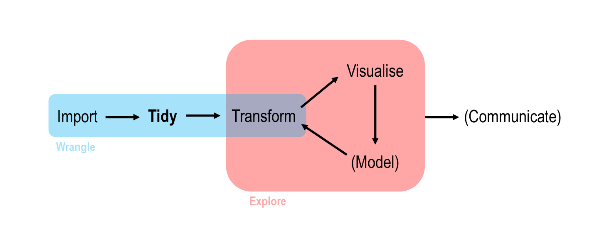
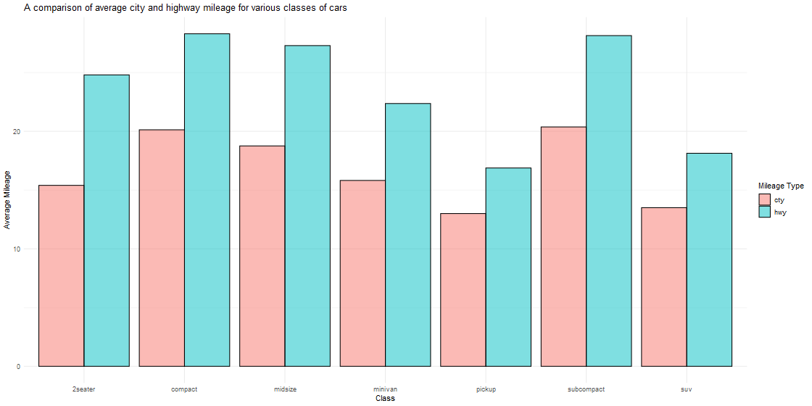

Into the Tidyverse | Session Four
====================================
author: Tim Hargreaves
width: 1440
height: 900
css: presentation.css

Recap
====================================
type: section


Statistics in R
====================================

* R has many useful statistical functions:
  * `mean()`, `median()`, `min()`, `max()`, `quantile()[i]`
  * `range()`, `diff()`, `IQR()`
  * `var()`, `sd()`
* Remember to use `na.rm = TRUE` if you have missing values

Comparisons and Boolean operators
====================================

* Comparisons in R can be done with `<`, `<=`, `>`, and `>=`
* Equality can be checked with `==`, `!=`, and `near()`
* R has three main Boolean operators `&` (and), `|` (or), and `!` (not)
* All of these comparisons and Boolean operators are vectorised

The dplyr Verbs
====================================

* There are five key `dplyr` functions referred to as verbs:
  * `filter()` - pick observations by their values
  * `arrange()` - reorder observations based on their values
  * `select()` - pick variables by their names
  * `mutate()` - create new variables as functions of existing variables
  * `summarise()`/`summarize()` - collapse many values down to a single summary
* These can be combined with `group_by()` to change the scope of aggregate functions
* When using multiple verbs, combine them with the pipe (`%>%`) operator

Tidy Data
====================================
type: section

Introduction
====================================
type: sub-section

Where Are We?
====================================

* _"Tidy datasets are all alike; but every messy dataset is messy in its own way"_ - Hadley Wickham
* This session is all about organising your data in a consistent way called _tidy data_
* This organisation scheme requires some work upfront but pays off in the long-run by making it much simpler to use the tools in the tidyverse



What is tidyr?
====================================
left: 70%

* `tidyr` is the foundational package in the tidyverse
*  It allows you to take a dataset in a non-tidy form and transform it into tidy data
*  Once data is in a tidy form, you can spend much less time munging data from one representation to another, allowing more time to answer difficult analytical questions

***


Data Representations
====================================

* You can represent the same underlying data in multiple ways
* The following example shows four different ways to organise the same data
* Each dataset shows the same values of four variables, `country`, `year`, `population`, and `cases`
* Only one of these is tidy data. We will discuss which one this is at a later point


Data Representations (cont.)
====================================


```r
table1
```

```
# A tibble: 6 x 4
  country      year  cases population
  <chr>       <int>  <int>      <int>
1 Afghanistan  1999    745   19987071
2 Afghanistan  2000   2666   20595360
3 Brazil       1999  37737  172006362
4 Brazil       2000  80488  174504898
5 China        1999 212258 1272915272
6 China        2000 213766 1280428583
```

Data Representations (cont.)
====================================


```r
table2
```

```
# A tibble: 12 x 4
   country      year type            count
   <chr>       <int> <chr>           <int>
 1 Afghanistan  1999 cases             745
 2 Afghanistan  1999 population   19987071
 3 Afghanistan  2000 cases            2666
 4 Afghanistan  2000 population   20595360
 5 Brazil       1999 cases           37737
 6 Brazil       1999 population  172006362
 7 Brazil       2000 cases           80488
 8 Brazil       2000 population  174504898
 9 China        1999 cases          212258
10 China        1999 population 1272915272
11 China        2000 cases          213766
12 China        2000 population 1280428583
```

Data Representations (cont.)
====================================


```r
table3
```

```
# A tibble: 6 x 3
  country      year rate             
* <chr>       <int> <chr>            
1 Afghanistan  1999 745/19987071     
2 Afghanistan  2000 2666/20595360    
3 Brazil       1999 37737/172006362  
4 Brazil       2000 80488/174504898  
5 China        1999 212258/1272915272
6 China        2000 213766/1280428583
```

Data Representations (cont.)
====================================


```r
table4a
```

```
# A tibble: 3 x 3
  country     `1999` `2000`
* <chr>        <int>  <int>
1 Afghanistan    745   2666
2 Brazil       37737  80488
3 China       212258 213766
```


```r
table4b
```

```
# A tibble: 3 x 3
  country         `1999`     `2000`
* <chr>            <int>      <int>
1 Afghanistan   19987071   20595360
2 Brazil       172006362  174504898
3 China       1272915272 1280428583
```

Tidy Data
====================================

* These are all representations of the same underlying data
* Despite this, they are not all equally easy to use
* Only one of these datasets is in a tidy format
* The tidy dataset will be much easier to work with inside of the tidyverse

Tidy Data (cont.)
====================================

* There a three interrelated rules which make a dataset tidy:

  1. Each variable (a value you can measure) must have its own column
  2. Each observation (a thing which has measurable properties) must have its own row
  3. Each value must have its own cell

* We can using the following graphic to represent this visually


Tidy Data (cont.)
====================================

* These rules are interrelated since it's impossible to only satisfy two of the three
* This interrelationship leads to an even simpler set of practical instructions:

  1. Put each dataset in tibble
  2. Put each variable in its own column


* According to these rules, only the first representation is tidy


```
# A tibble: 6 x 4
  country      year  cases population
  <chr>       <int>  <int>      <int>
1 Afghanistan  1999    745   19987071
2 Afghanistan  2000   2666   20595360
3 Brazil       1999  37737  172006362
4 Brazil       2000  80488  174504898
5 China        1999 212258 1272915272
6 China        2000 213766 1280428583
```

* We can now look at why the other representations are not tidy and how we can fix this

Gathering
====================================
type: sub-section

An Untidy Example
====================================

* Let's start by having a look at the first tibble in the fourth representation


```r
table4a
```

```
# A tibble: 3 x 3
  country     `1999` `2000`
* <chr>        <int>  <int>
1 Afghanistan    745   2666
2 Brazil       37737  80488
3 China       212258 213766
```

* This representation violates the first rule of tidy data - each variable must have its own column
* Here we have two columns, `1999` and `2000`, which do not represent variables
* Instead they represent specific values of the `year` variable
* As a consequence, it also violates the second rule - each observation must have its own row
* This is because each row corresponds to two observations, one from each year

Tidying the Dataset
====================================

* To tidy a dataset like this we need to _gather_ those two non-variable columns into a new pair of variables
* To describe this operation we need three parameters:
  * The set of columns that are not variables (`1999` and `2000` in this case)
  * The name of the variable whose values form the column names (we said before that this is `year`). We refer to this as the `key`
  * The name of the variable whose values are spread over the cells (here it is `cases`). We refer to this as the `value`
  
Tidying the Dataset (cont.)
====================================

* We can use these parameters in a call to `gather()`


```r
table4a %>%
  # use backticks so R doesn't confuse the column names for numbers
  gather(`1999`, `2000`, key = "year", value = "cases")
```

```
# A tibble: 6 x 3
  country     year   cases
  <chr>       <chr>  <int>
1 Afghanistan 1999     745
2 Brazil      1999   37737
3 China       1999  212258
4 Afghanistan 2000    2666
5 Brazil      2000   80488
6 China       2000  213766
```

* We could perform a similar process to tidy `table4b` though this time our `value` would be `"population"`
* To combine these two tables we would then have to use techniques covered later in this session

Diagramming the Transformation
====================================

* We can use the following diagram to show the gathering process we just performed.


Spreading
====================================
type: sub-section

An Untidy Example
====================================

* Now let's take a look at the second representation


```r
table2
```

```
# A tibble: 12 x 4
   country      year type            count
   <chr>       <int> <chr>           <int>
 1 Afghanistan  1999 cases             745
 2 Afghanistan  1999 population   19987071
 3 Afghanistan  2000 cases            2666
 4 Afghanistan  2000 population   20595360
 5 Brazil       1999 cases           37737
 6 Brazil       1999 population  172006362
 7 Brazil       2000 cases           80488
 8 Brazil       2000 population  174504898
 9 China        1999 cases          212258
10 China        1999 population 1272915272
11 China        2000 cases          213766
12 China        2000 population 1280428583
```

* This suffers from the opposite problem of the last representation
* Each observation is scattered across two rows and the variables `cases` and `population` are contained in the `type` column

Tidying the Dataset
====================================

* We can use the `spread()` function to fix this issue
* This time we only need two parameters:
  * The column which contains the variable names (here, it's `type`) which we referred to as the `key`
  * The column that contains values from multiple variables (here it's `count`) which we referred to as the `value`
  
Tidying the Dataset (cont.)
====================================

* We can use these parameters in a call to `spread()`


```r
table2 %>%
  spread(key = type, value = count)
```

```
# A tibble: 6 x 4
  country      year  cases population
  <chr>       <int>  <int>      <int>
1 Afghanistan  1999    745   19987071
2 Afghanistan  2000   2666   20595360
3 Brazil       1999  37737  172006362
4 Brazil       2000  80488  174504898
5 China        1999 212258 1272915272
6 China        2000 213766 1280428583
```

* We don't have to use quotes for `type` and `count` since they already exist in the dataset whereas with `gather()` we were adding them

Diagramming the Transformation
====================================

* We can use the following diagram to show the spreading process we just performed.


Spreading and Gathering
====================================

* As you might be able to guess from the common `key` and `value` arguments, `spread()` and `gather()` are opposites of each other and can be used to reverse each other's effects
* `gather()` makes wide tables narrower and longer, whereas `spread()` makes long tables shorter and wider
* Collectively, these operations are known as pivoting (think pivot tables in Excel)
* A general rule of thumb is that wide tables are best for looking at data, whereas tall tables are best for performing analysis.

Aside: Pivoting
====================================

* Since tidyr 1.0.0 (September 2019), a new syntax for pivoting tables has been introduced
* This uses two functions `pivot_longer()` and `pivot_wider()` which have a more intuitive syntax than `gather()` and `spread()`
* As of writing this presentation, these functions are still in `experimental` lifecycle, and soon to move into `maturing` with tidyr 1.1.0
* Even though this new syntax is more elegant, most examples and existing code uses the old syntax, so it is important to know this
* You can, however, learn more about pivoting [here](https://tidyr.tidyverse.org/articles/pivot.html)

Separating
====================================
type: sub-section

An Untidy Example
====================================

* The last representation to look at is number three


```r
table3
```

```
# A tibble: 6 x 3
  country      year rate             
* <chr>       <int> <chr>            
1 Afghanistan  1999 745/19987071     
2 Afghanistan  2000 2666/20595360    
3 Brazil       1999 37737/172006362  
4 Brazil       2000 80488/174504898  
5 China        1999 212258/1272915272
6 China        2000 213766/1280428583
```

* This violates the last rule of tidy data - each value must have its own cell
* As a consequence we also end up with a non-variable column `rate`

Tidying the Dataset
====================================

* We can use the `separate()` function to fix this issue
* We will need to specify two parameters:
  * The column that we want to split into multiple columns wherever a separator character appears
  * The names of the new columns to create as a character vector
* By default `separate()` will split values whenever it sees a non-alphanumeric character though this can be specified manually using the `sep` argument
* We also need to specify `convert = TRUE` if we want `tidyr` to automatically convert the new columns to the correct data types (by default they would still be characters)
  
Tidying the Dataset (cont.)
====================================

* We then use these parameters in a call to `separate()`


```r
table3 %>%
  separate(rate, into = c('cases', 'population'), sep = '/', convert = TRUE)
```

```
# A tibble: 6 x 4
  country      year  cases population
  <chr>       <int>  <int>      <int>
1 Afghanistan  1999    745   19987071
2 Afghanistan  2000   2666   20595360
3 Brazil       1999  37737  172006362
4 Brazil       2000  80488  174504898
5 China        1999 212258 1272915272
6 China        2000 213766 1280428583
```

* **Bonus Note:** You can pass `separate()` a vector of integers as the `sep` argument to be used as the positions to split at

Diagramming the Transformation
====================================

* We can use the following diagram to show the spreading process we just performed.


Uniting
====================================
type: sub-section

An Untidy Example
====================================

* Here is another representation of the dataset we've been looking that we did not include earlier


```r
table5
```

```
# A tibble: 6 x 4
  country     century year  rate             
* <chr>       <chr>   <chr> <chr>            
1 Afghanistan 19      99    745/19987071     
2 Afghanistan 20      00    2666/20595360    
3 Brazil      19      99    37737/172006362  
4 Brazil      20      00    80488/174504898  
5 China       19      99    212258/1272915272
6 China       20      00    213766/1280428583
```

* This violates the last rule of tidy data too but in an opposite way
* Here, the value of year has been split up into two cells, one containing the century and one containing the rest

Tidying the Dataset
====================================

* We can use the `unite()` function to fix this issue
* We will need to specify the following parameters:
  * The name of the new column to create
  * The set of columns to combine
* Optionally, we can also include a `sep` argument to specify the separator or use the default `_`
  
Tidying the Dataset (cont.)
====================================

* We then use these parameters in a call to `unite()`


```r
table5 %>%
  unite(new, century, year, sep = '')
```

```
# A tibble: 6 x 3
  country     new   rate             
  <chr>       <chr> <chr>            
1 Afghanistan 1999  745/19987071     
2 Afghanistan 2000  2666/20595360    
3 Brazil      1999  37737/172006362  
4 Brazil      2000  80488/174504898  
5 China       1999  212258/1272915272
6 China       2000  213766/1280428583
```

* `unite()` does not have a `convert` parameter so we would have to perform this conversion manually
* In this case we would use `mutate(year = as.integer(year))`

Diagramming the Transformation
====================================

* We can use the following diagram to show the spreading process we just performed.


Relational Data
====================================
type: section

Introduction
====================================
type: sub-section

Where Are We?
====================================

* We now make a return to the transformation part of the data analysis pipeline
* It's rare that a data analysis project will only concern a single table of data so in this section we learn how to combine tables to answer questions we are interested in
* We will be using `dplyr` to help us do this using a new set of functions from the package


Relationships
====================================

* Relations are always defined between pairs of tables. All other relations are built up from this simple idea: the relations of three or more tables are always a property of the relations between the pairs
* There are many ways to deal with relational data but due to time constraints, we will only be looking at the most critical types - _mutating joins_
* The other two main types are _filtering joins_ and _set operations_. These can be read about in R4DS chapter 10 if you need these for your work in the DataViz battle

Mutating Joins
====================================
type: sub-section

Introduction
====================================

* A mutating join allows you to combine variables from two tables
* This is performed by matching observations on a collection of columns (or single column) known as the key
* There are different types of joins which handle missing values in different ways
* Any join takes three main arguments
  * Two tables which will be joined together
  * A single column name or vector of column names to be used as the key
* The output of a join contains the shared keys as well as the other columns from both tables
  
Band Membership
====================================

* To illustrate the various join types, we use the following toy dataset made of two tables


```r
band_members
```

```
# A tibble: 3 x 2
  name  band   
  <chr> <chr>  
1 Mick  Stones 
2 John  Beatles
3 Paul  Beatles
```


```r
band_instruments
```

```
# A tibble: 3 x 2
  name  plays 
  <chr> <chr> 
1 John  guitar
2 Paul  bass  
3 Keith guitar
```

Inner Join
====================================

* The inner join is the simplest join
* It matches pairs of observations whenever their keys are equal
* The output of an inner join only contains rows which contained the key in both tables


```r
inner_join(band_members, band_instruments, by = 'name')
```

```
# A tibble: 2 x 3
  name  band    plays 
  <chr> <chr>   <chr> 
1 John  Beatles guitar
2 Paul  Beatles bass  
```

* Here, neither Mick nor Keith are included in the result as they don't appear in both tables

Left Join
====================================

* A left join will result in a table containing every value of the key appearing in the piped-in table
* Any missing values will be filled in with `na`
* It is called a left join since the keys that are preserved come from the table used as the left argument


```r
left_join(band_members, band_instruments, by = 'name')
```

```
# A tibble: 3 x 3
  name  band    plays 
  <chr> <chr>   <chr> 
1 Mick  Stones  <NA>  
2 John  Beatles guitar
3 Paul  Beatles bass  
```

* Here the result contains all 3 musicians featured in the `band_members` table

Right Join
====================================

* A right join is the opposite of a left join
* It preserves all keys that come from the table used as the right argument


```r
right_join(band_members, band_instruments, by = 'name')
```

```
# A tibble: 3 x 3
  name  band    plays 
  <chr> <chr>   <chr> 
1 John  Beatles guitar
2 Paul  Beatles bass  
3 Keith <NA>    guitar
```

* Here the result contains all 3 musicians featured in the `band_instruments` table

Full Join
====================================

* A full join combines the behaviour of a left and right join
* It creates a row in the result for every key that appears in either table


```r
full_join(band_members, band_instruments, by = 'name')
```

```
# A tibble: 4 x 3
  name  band    plays 
  <chr> <chr>   <chr> 
1 Mick  Stones  <NA>  
2 John  Beatles guitar
3 Paul  Beatles bass  
4 Keith <NA>    guitar
```

Differing Key Column Names
====================================

* It is not always the case that your key columns will have the same names
* Here is an altered version of the previous problem demonstrating this:


```r
names(band_members)
```

```
[1] "name" "band"
```


```r
names(band_instruments2)
```

```
[1] "artist" "plays" 
```

* We can still perform joins but we have to slightly modify our syntax to the following


```r
inner_join(band_members, band_instruments2, by = c("name" = "artist"))
```

```
# A tibble: 2 x 3
  name  band    plays 
  <chr> <chr>   <chr> 
1 John  Beatles guitar
2 Paul  Beatles bass  
```

Duplicate Keys
====================================

* Mutating joins also work when one table has duplicate keys
* Detailed discussion of this is beyond the scope of this course but here is a brief example


```r
employees <- tibble(name = c('John', 'Anne'), experience = c(4, 7))
sales <- tibble(item_code = c('21', '52', '35'), sold_by = c('John', 'Anne', 'Anne'))
sales %>%
  inner_join(employees, by = c('sold_by' = 'name'))
```

```
# A tibble: 3 x 3
  item_code sold_by experience
  <chr>     <chr>        <dbl>
1 21        John             4
2 52        Anne             7
3 35        Anne             7
```


Aside: Tidy Data in Practice
====================================

* How would we create this graph?



