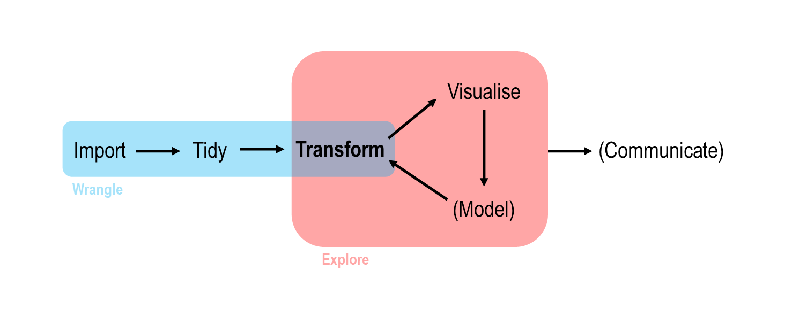

An Introduction to the Tidyverse | Session Three
====================================
author: Tim Hargreaves
date: 2019-10-17
width: 1440
height: 900
css: presentation.css


Recap
====================================
type: section

Vectors and Arithmetic
====================================

* You typically create a vector in R using the `c()` function


```r
x <- c(1, 4, 9)
x
```

```
[1] 1 4 9
```

* You can create a vector whose entries are an arithmetic sequence using `seq()`


```r
seq(-5, 5, length.out = 6)
```

```
[1] -5 -3 -1  1  3  5
```

* Most arithmetical operators in R are _vectorised_


```r
sqrt(x)
```

```
[1] 1 2 3
```

Reading CSVs
====================================

* We read CSVs in R using the `read_csv()` function from the `readr` package
* The first argument we pass in is the path to the file we want to import
* This path should be relative to our current working directory


```r
# import a csv file at ~/project_name/data/my_data.csv
setwd('~/project_name') # or use Session > Set Working Director > ...

read_csv('data/my_data.csv')
```

readr Parameters
====================================

* Sometimes you need to specify additional parameters when reading files. These include:
  * `skip = n` - skip the first `n` lines of the file
  * `comment = '{char}'` - ignore lines which begin with `{char}`
  * `col_names = FALSE` - the file has no column names and we don't know them
  * `col_names = c('col1_name', ...)` - the file has no column names but we do know them
  * `na = '{char}'` - import `{char}` as a missing value
  * `col_types = cols(col1 = col_{type}(), ...)` - override types of columns

Line Plots
====================================

* Line plots can be made using `geom_line()` or `geom_smooth()`
* Key aesthetics are `linetype` and `group`
* Remove error bars with `se = FALSE`
* Choose which smoothing method to use with `method = 'lm'/'loess'/'gam'` 

Back to the Basics
====================================
type: section

Introduction
====================================

* There are still many basic features that we have omitted learning about
* These will be important when we start manipulating datasets
* We therefore focus on them now

R for Statistics
====================================
type: sub-section

* Statistics is R's speciality
* Despite this we've barely even used this functionality
* A statistic is a function of data points
* Examples include mean, median, maximum, etc.

Measures of Location
====================================


```r
x <- c(4, 10, 10, 12, 19)
```


```r
mean(x)
```

```
[1] 11
```


```r
median(x)
```

```
[1] 10
```


```r
quantile(x)
```

```
  0%  25%  50%  75% 100% 
   4   10   10   12   19 
```


```r
quantile(x)[2]
```

```
25% 
 10 
```

Measures of Spread
====================================


```r
x <- c(4, 10, 10, 12, 19)
```


```r
# returns two values
range(x)
```

```
[1]  4 19
```


```r
# use diff() to find difference
diff(range(x))
```

```
[1] 15
```


```r
# returns one value
IQR(x)
```

```
[1] 2
```

Measures of Spread (cont.)
====================================


```r
x <- c(4, 10, 10, 12, 19)
```


```r
# variance
var(x)
```

```
[1] 29
```


```r
# standard deviation = sqrt(variance)
sd(x)
```

```
[1] 5.385165
```

Handling Missing Values
====================================

* If a vector containing a missing value (`NA`) has a statistical transformation applied to it then the result will _always_ be `NA`


```r
x <- c(1, 5, 10, NA, 12)
mean(x)
```

```
[1] NA
```

* This can be avoid by setting `na.rm = TRUE`


```r
mean(x, na.rm = TRUE)
```

```
[1] 7
```

Comparisons and Boolean Operators
====================================
type: sub-section

* It is very useful to be able to compare two values and ask how they relate - Is one larger than the other? Are they the same value?
* We can go even further by stringing these comparisons together using Boolean operators (and, or, etc.)

Ordering Comparisons
====================================


```r
4 < 6
```

```
[1] TRUE
```


```r
3 <= 3
```

```
[1] TRUE
```


```r
5 < 4
```

```
[1] FALSE
```


```r
5 >= 4
```

```
[1] TRUE
```

Equality Comparisons
====================================


```r
# use double ='s to check for equality
# a single equals is already used for specifying parameters of function
4 == 4
```

```
[1] TRUE
```


```r
4 == 5
```

```
[1] FALSE
```


```r
4 != 4
```

```
[1] FALSE
```


```r
4 != 5
```

```
[1] TRUE
```

Comparisons on Vectors
====================================

* All comparisons in R are _vectorised_. This means that they act element-wise on vectors


```r
x <- c(2, 6, 10)
y <- c(3, 5, 10)
```


```r
x <= y
```

```
[1]  TRUE FALSE  TRUE
```


```r
x == y
```

```
[1] FALSE FALSE  TRUE
```

* You can transform a logical vector into a single logical value using `all()` and `any()`. See their corresponding help pages for more details

Boolean Operators (and)
====================================


```r
TRUE & TRUE
```

```
[1] TRUE
```


```r
TRUE & FALSE
```

```
[1] FALSE
```


```r
FALSE & FALSE
```

```
[1] FALSE
```

Boolean Operators (or)
====================================


```r
TRUE | TRUE
```

```
[1] TRUE
```


```r
TRUE | FALSE
```

```
[1] TRUE
```


```r
FALSE | FALSE
```

```
[1] FALSE
```

* Note, unlike in normal usage, when programming, or is inclusive. I.e. if both inputs to `|` are `TRUE` then so is the output

Boolean Operators (not)
====================================


```r
!TRUE
```

```
[1] FALSE
```


```r
!FALSE
```

```
[1] TRUE
```

Combining Boolean Operators
====================================


```r
(4 > 3) & (2 == 1)
```

```
[1] FALSE
```


```r
(7 != 5) | (4 < 2)
```

```
[1] TRUE
```


```r
(!(4 < 3)) & (2 == 2)
```

```
[1] TRUE
```

* The brackets above are not actually needed due the order of operations in R
* It is best to always include them until you have a lot of practice though as this avoids errors that are difficult to diagnose
* See `?Syntax` for more information

Boolean Operators on Vectors
====================================

* Boolean operators are also vectorised


```r
x <- c(1, 5, 9); y <- c(2, 5, 7); z <- c(1, 6, 8)

x == y
```

```
[1] FALSE  TRUE FALSE
```

```r
y < z
```

```
[1] FALSE  TRUE  TRUE
```

```r
(x == y) & (y < z)
```

```
[1] FALSE  TRUE FALSE
```

```r
!(x == y)
```

```
[1]  TRUE FALSE  TRUE
```

Data Transformation
====================================
type: section

Introduction
====================================
type: sub-section

Where Are We?
====================================

* We now take a step backwards to look at data transformation using the tidyverse
* This session is all about taking a dataset, transforming it into a form that meets our needs, and using it to answer questions



What is dplyr?
====================================
left: 70%

* `dplyr` is the third tidyverse package that we will be looking at
*  It has five main features, referred to as the `dplyr` _verbs_
*  These allow you to filter a dataste or transform it by creating new variables/summaries
*  You can also use these to reorder your observations to make a dataset easier to work with

***


The dplyr Verbs
====================================

* There are five key `dplyr` functions referred to as verbs. 
* These alone allow you to handle the majority of data manipulation tasks
* They are:
  * `filter()` - pick observations by their values
  * `arrange()` - reorder observations based on their values
  * `select()` - pick variables by their names
  * `mutate()` - create new variables as functions of existing variables
  * `summarise()`/`summarize()` - collapse many values down to a single summary
  
The dplyr Verbs (cont.)
====================================

* These verbs can all be used in conjunction with `group_by()` which changes the scope of each function from operating on the entire dataset to operating on it group-by-group. More on this later
* All five main verbs plus the `group_by` verb work similarly:
  * The first argument is a data frame
  * The subsequent arguments describe what to do with the data frame, using the variable names (without quotes)
  * The result is a new data frame


Filter Rows
====================================
type: sub-section

Introduction
====================================


```r
filter(mpg, cty > 30, cyl == 4)
```

```
# A tibble: 2 x 11
  manufacturer model  displ  year   cyl trans drv     cty   hwy fl    class
  <chr>        <chr>  <dbl> <int> <int> <chr> <chr> <int> <int> <chr> <chr>
1 volkswagen   jetta    1.9  1999     4 manu~ f        33    44 d     comp~
2 volkswagen   new b~   1.9  1999     4 manu~ f        35    44 d     subc~
```

* **Warning:** Don't confuse `==` with `=` else you'll get the error 

  `Error: [...] must not be named, do you need '=='?`
  
Filtering with Boolean Operators
====================================

* We can use Boolean operators in filter clauses


```r
filter(mpg, model == 'land cruiser wagon 4wd' | displ > 6.8)
```

```
# A tibble: 3 x 11
  manufacturer model  displ  year   cyl trans drv     cty   hwy fl    class
  <chr>        <chr>  <dbl> <int> <int> <chr> <chr> <int> <int> <chr> <chr>
1 chevrolet    corve~   7    2008     8 manu~ r        15    24 p     2sea~
2 toyota       land ~   4.7  1999     8 auto~ 4        11    15 r     suv  
3 toyota       land ~   5.7  2008     8 auto~ 4        13    18 r     suv  
```

* Another useful operator is `%in%` which checks if a value is in a vector


```r
filter(band_members, name %in% c('John', 'Paul'))
```

```
# A tibble: 2 x 2
  name  band   
  <chr> <chr>  
1 John  Beatles
2 Paul  Beatles
```

Handling Floating-point Numbers
====================================

* Computers cannot perform arithmetic with infinite precision. This leads to peculiar results.


```r
sqrt(2) ^ 2 == 2
```

```
[1] FALSE
```

```r
(1 / 49) * 49 == 1
```

```
[1] FALSE
```

* When handling values that are not integers, use the `near()` function to check for equivalence.


```r
near(sqrt(2) ^ 2, 2)
```

```
[1] TRUE
```

```r
near((1 / 49) * 49, 1)
```

```
[1] TRUE
```

Handling Missing Values
====================================

* In many cases you may want to either remove missing values or look only at rows which contain a missing value
* The `is.na()` function can be used to this extent


```r
df <- tibble(x = c(1, NA, 3), y = c(4, 5, 6))
filter(df, is.na(x))
```

```
# A tibble: 1 x 2
      x     y
  <dbl> <dbl>
1    NA     5
```

```r
filter(df, !is.na(x))
```

```
# A tibble: 2 x 2
      x     y
  <dbl> <dbl>
1     1     4
2     3     6
```

Arrange Rows
====================================
type: sub-section

Introduction
====================================

* `arrange()` orders observations by one or more variables in **ascending** order
* The observations are ordered by the first column, then ties are settled by the second, etc.


```r
# order by class, break ties with year
arrange(mpg, class, year)
```

```
# A tibble: 234 x 11
   manufacturer model displ  year   cyl trans drv     cty   hwy fl    class
   <chr>        <chr> <dbl> <int> <int> <chr> <chr> <int> <int> <chr> <chr>
 1 chevrolet    corv~   5.7  1999     8 manu~ r        16    26 p     2sea~
 2 chevrolet    corv~   5.7  1999     8 auto~ r        15    23 p     2sea~
 3 chevrolet    corv~   6.2  2008     8 manu~ r        16    26 p     2sea~
 4 chevrolet    corv~   6.2  2008     8 auto~ r        15    25 p     2sea~
 5 chevrolet    corv~   7    2008     8 manu~ r        15    24 p     2sea~
 6 audi         a4      1.8  1999     4 auto~ f        18    29 p     comp~
 7 audi         a4      1.8  1999     4 manu~ f        21    29 p     comp~
 8 audi         a4      2.8  1999     6 auto~ f        16    26 p     comp~
 9 audi         a4      2.8  1999     6 manu~ f        18    26 p     comp~
10 audi         a4 q~   1.8  1999     4 manu~ 4        18    26 p     comp~
# ... with 224 more rows
```

Descending Order
====================================

* You can wrap a variable in `desc()` to use descending order for that column


```r
arrange(mpg, class, desc(year))
```

```
# A tibble: 234 x 11
   manufacturer model displ  year   cyl trans drv     cty   hwy fl    class
   <chr>        <chr> <dbl> <int> <int> <chr> <chr> <int> <int> <chr> <chr>
 1 chevrolet    corv~   6.2  2008     8 manu~ r        16    26 p     2sea~
 2 chevrolet    corv~   6.2  2008     8 auto~ r        15    25 p     2sea~
 3 chevrolet    corv~   7    2008     8 manu~ r        15    24 p     2sea~
 4 chevrolet    corv~   5.7  1999     8 manu~ r        16    26 p     2sea~
 5 chevrolet    corv~   5.7  1999     8 auto~ r        15    23 p     2sea~
 6 audi         a4      2    2008     4 manu~ f        20    31 p     comp~
 7 audi         a4      2    2008     4 auto~ f        21    30 p     comp~
 8 audi         a4      3.1  2008     6 auto~ f        18    27 p     comp~
 9 audi         a4 q~   2    2008     4 manu~ 4        20    28 p     comp~
10 audi         a4 q~   2    2008     4 auto~ 4        19    27 p     comp~
# ... with 224 more rows
```

* Note that there is a convention that `TRUE` is greater than `FALSE` since the underlying representation of these objects are `1` and `0` respectively

Missing Values
====================================

* Missing values are always sorted at the end


```r
df <- tibble(x = c(1, NA, 5))
arrange(df, x)
```

```
# A tibble: 3 x 1
      x
  <dbl>
1     1
2     5
3    NA
```

```r
arrange(df, desc(x))
```

```
# A tibble: 3 x 1
      x
  <dbl>
1     5
2     1
3    NA
```

Select Columns
====================================
type: sub-section

Introduction
====================================

* It is not unusual to get be given a dataset with hundreds or even thousands of columns
* In this case, you may want to narrow this down to variables you actually care about


```r
select(iris, Petal.Length, Petal.Width, Species)
```

```
# A tibble: 150 x 3
   Petal.Length Petal.Width Species
          <dbl>       <dbl> <fct>  
 1          1.4         0.2 setosa 
 2          1.4         0.2 setosa 
 3          1.3         0.2 setosa 
 4          1.5         0.2 setosa 
 5          1.4         0.2 setosa 
 6          1.7         0.4 setosa 
 7          1.4         0.3 setosa 
 8          1.5         0.2 setosa 
 9          1.4         0.2 setosa 
10          1.5         0.1 setosa 
# ... with 140 more rows
```

Dropping Columns
====================================

* You can get rid of columns by prefixing their name with a `-` symbol


```r
select(iris, -Species)
```

```
# A tibble: 150 x 4
   Sepal.Length Sepal.Width Petal.Length Petal.Width
          <dbl>       <dbl>        <dbl>       <dbl>
 1          5.1         3.5          1.4         0.2
 2          4.9         3            1.4         0.2
 3          4.7         3.2          1.3         0.2
 4          4.6         3.1          1.5         0.2
 5          5           3.6          1.4         0.2
 6          5.4         3.9          1.7         0.4
 7          4.6         3.4          1.4         0.3
 8          5           3.4          1.5         0.2
 9          4.4         2.9          1.4         0.2
10          4.9         3.1          1.5         0.1
# ... with 140 more rows
```

Selecting Ranges
====================================

* You can use the `:` operator to select or remove columns in a range (inclusive)


```r
select(iris, Sepal.Length:Petal.Length)
```

```
# A tibble: 150 x 3
   Sepal.Length Sepal.Width Petal.Length
          <dbl>       <dbl>        <dbl>
 1          5.1         3.5          1.4
 2          4.9         3            1.4
 3          4.7         3.2          1.3
 4          4.6         3.1          1.5
 5          5           3.6          1.4
 6          5.4         3.9          1.7
 7          4.6         3.4          1.4
 8          5           3.4          1.5
 9          4.4         2.9          1.4
10          4.9         3.1          1.5
# ... with 140 more rows
```

Selecting Ranges (cont.)
====================================

* This also works with `-`


```r
select(iris, -(Sepal.Length:Petal.Length))
```

```
# A tibble: 150 x 2
   Petal.Width Species
         <dbl> <fct>  
 1         0.2 setosa 
 2         0.2 setosa 
 3         0.2 setosa 
 4         0.2 setosa 
 5         0.2 setosa 
 6         0.4 setosa 
 7         0.3 setosa 
 8         0.2 setosa 
 9         0.2 setosa 
10         0.1 setosa 
# ... with 140 more rows
```

Selection Helper Functions
====================================

* There are a number of helper functions you can use within `select()`:
  * `starts_with('abc')`
  * `ends_with('xyz')`
  * `contains('ijk')`
  * `num_range('var', 2:4)` - matches `var2`, `var3`, `var4`
  * `everything` - matches all variables
* See `?select_helpers`/`?select` for more information

Renaming Columns
====================================

* `select()` can be used to rename columns but this can be more easily achieved using `rename()`


```r
rename(iris, length_of_sepal = Sepal.Length, width_of_sepal = Sepal.Width)
```

```
# A tibble: 150 x 5
   length_of_sepal width_of_sepal Petal.Length Petal.Width Species
             <dbl>          <dbl>        <dbl>       <dbl> <fct>  
 1             5.1            3.5          1.4         0.2 setosa 
 2             4.9            3            1.4         0.2 setosa 
 3             4.7            3.2          1.3         0.2 setosa 
 4             4.6            3.1          1.5         0.2 setosa 
 5             5              3.6          1.4         0.2 setosa 
 6             5.4            3.9          1.7         0.4 setosa 
 7             4.6            3.4          1.4         0.3 setosa 
 8             5              3.4          1.5         0.2 setosa 
 9             4.4            2.9          1.4         0.2 setosa 
10             4.9            3.1          1.5         0.1 setosa 
# ... with 140 more rows
```

Add New Variables
====================================
type: sub-section

Introduction
====================================

* `mutate()` lets you transform one or more variables currently in your dataset to create a new one
* The new column is added at the end of the dataset or in the same place as before if it overwrites an existing column


```r
temps <- tibble(day = c('Mon', 'Tues', 'Wed'), temp_c = c(22, 24, 19))
```


```r
mutate(temps, temp_f = temp_c * 1.8 + 32)
```

```
# A tibble: 3 x 3
  day   temp_c temp_f
  <chr>  <dbl>  <dbl>
1 Mon       22   71.6
2 Tues      24   75.2
3 Wed       19   66.2
```

Functions of Multiple Variables
====================================

* You can use multiple variables to create a new column


```r
health <- tibble(name = c('Ann', 'Bob', 'Charlie'), 
                 weight = c(71, 87, 65),
                 height = c(1.68, 1.77, 1.72))
```


```r
mutate(health, bmi = weight / height ^ 2)
```

```
# A tibble: 3 x 4
  name    weight height   bmi
  <chr>    <dbl>  <dbl> <dbl>
1 Ann         71   1.68  25.2
2 Bob         87   1.77  27.8
3 Charlie     65   1.72  22.0
```

Referencing New Columns
====================================

* You are also allowed to reference columns that you've just created


```r
sprint <- tibble(time_sec = c(1, 3, 5), dist_m = c(8, 26, 47))
```


```r
mutate(sprint, 
       avg_speed_m_sec = dist_m / time_sec,
       avg_speed_km_hr = avg_speed_m_sec * 3.6)
```

```
# A tibble: 3 x 4
  time_sec dist_m avg_speed_m_sec avg_speed_km_hr
     <dbl>  <dbl>           <dbl>           <dbl>
1        1      8            8               28.8
2        3     26            8.67            31.2
3        5     47            9.4             33.8
```

Useful Creation Functions
====================================

* Basic arithmetic operators: `+`, `-`, `*`, `/`/ `^`
* Aggregate functions: `x / sum(x)` (proportion), `y - mean(y)` (centring)
* Modular arithmetic: `%/%` (integer division), `%%` (remainder)


```r
times <- tibble(time = c(0923, 1321, 1908))
mutate(times,
       hour = time %/% 100,
       min = time %% 100)
```

```
# A tibble: 3 x 3
   time  hour   min
  <dbl> <dbl> <dbl>
1   923     9    23
2  1321    13    21
3  1908    19     8
```

* Logarithms: `log()` (natural), `log2()`, `log10()`

Useful Creation Functions (cont.)
====================================

* Cumulative aggregates: `cumsum()`, `cumprod()`, `cummin()`, `cummax()`, `cummean()`


```r
mutate(tibble(x = c(1, 4, 0)), sum = cumsum(x), prod = cumprod(x), 
       min = cummin(x), max = cummax(x), mean = cummean(x))
```

```
# A tibble: 3 x 6
      x   sum  prod   min   max  mean
  <dbl> <dbl> <dbl> <dbl> <dbl> <dbl>
1     1     1     1     1     1  1   
2     4     5     4     1     4  2.5 
3     0     5     0     0     4  1.67
```

* Logical Comparisons: `<`, `<=`, `>`, `>=`, `==`, `!=`


```r
mutate(tibble(time = c(1147, 1252)), afternoon = time >= 1200)
```

```
# A tibble: 2 x 2
   time afternoon
  <dbl> <lgl>    
1  1147 FALSE    
2  1252 TRUE     
```

Summarise Values
====================================
type: sub-section

Introduction
====================================

* `summarise()` (or US spelling `summarize()`) allows you to collapse a data frame to a single row based on an aggregation function


```r
profits <- tibble(day = c('Mon', 'Tues', 'Wed', 'Thurs', 'Fri'), 
                  profit = c(323, 432, 491, NA, 402))
```


```r
summarise(profits, avg_profit = mean(profit, na.rm = TRUE))
```

```
# A tibble: 1 x 1
  avg_profit
       <dbl>
1        412
```

Group Summaries
====================================

* `summarise()` by itself is not very useful. We could have done this with `mean(profits$profit, na.rm = TRUE)`
* The real power comes when it is combined with the `group_by()` function


```r
profits <- tibble(day = c('Mon', 'Tues', 'Wed', 'Thurs', 'Fri', 'Sat', 'Sun'),
                  wkdy = c(TRUE, TRUE, TRUE, TRUE, TRUE, FALSE, FALSE),
                  profit = c(323, 432, 491, NA, 402, 631, 583))
```


```r
by_wkdy <- group_by(profits, wkdy)
```


```r
summarise(by_wkdy, avg_profit = mean(profit, na.rm = TRUE))
```

```
# A tibble: 2 x 2
  wkdy  avg_profit
  <lgl>      <dbl>
1 FALSE        607
2 TRUE         412
```

Multiple Summaries
====================================

* You can summarise multiple variables in one go or have multiple summaries for a single variable


```r
by_species <- group_by(iris, Species)
```


```r
summarise(by_species, mean_sepal_len = mean(Sepal.Length),
          count = n(),  # use function n() to count how many in each group
          range_of_petal_width = diff(range(Petal.Width)))
```

```
# A tibble: 3 x 4
  Species    mean_sepal_len count range_of_petal_width
  <fct>               <dbl> <int>                <dbl>
1 setosa               5.01    50                  0.5
2 versicolor           5.94    50                  0.8
3 virginica            6.59    50                  1.1
```

Grouping by multiple variables
====================================

* You are not limited to grouping by only one variable


```r
mon_split <- mutate(airquality, mon_half = ifelse(Day <= 15, 'Start', 'End'))
```


```r
airquality_grpd <- group_by(mon_split, Month, mon_half)
```


```r
summarise(airquality_grpd, med_wind = median(Wind))
```

```
# A tibble: 10 x 3
# Groups:   Month [5]
   Month mon_half med_wind
   <int> <chr>       <dbl>
 1     5 End         11.8 
 2     5 Start       10.9 
 3     6 End          9.2 
 4     6 Start        9.7 
 5     7 End          8.3 
 6     7 Start        9.2 
 7     8 End          8.85
 8     8 Start        8.6 
 9     9 End         10.3 
10     9 Start       10.3 
```

Aside: Piping
====================================

* `dpylr` comes with an amazing tool called the pipe - `%>%`
* This allows you to pass the output of one function into the first argument of the next
* Using this, the previous code can by rewritten as


```r
airquality %>%
  mutate(mon_half = ifelse(Day <= 15, 'Start', 'End')) %>%
  group_by(Month, mon_half) %>%
  summarise(med_wind = median(Wind))
```

* Essentially, you only need to mention a single data frame at the start and never need to create temporary objects

Combining dpylr with ggplot
====================================

* Question: of all large diamonds of colour `G`, what is the median volume (assume approximate ellipsoidality) for each cut?


```r
diamonds %>%
  filter(color == 'G') %>%
  # volume of ellipsoid: https://en.wikipedia.org/wiki/Ellipsoid#Volume
  mutate(vol = 4/3 * pi * x * y * z) %>%
  group_by(cut) %>%
  summarise(med_vol = median(vol)) %>%
  ggplot(aes(x = cut, y = med_vol, fill = cut)) +
    # we'll learn more about geom_col in session 5
    geom_col()
```

* This is a very complex example so try to work through it bit by bit
